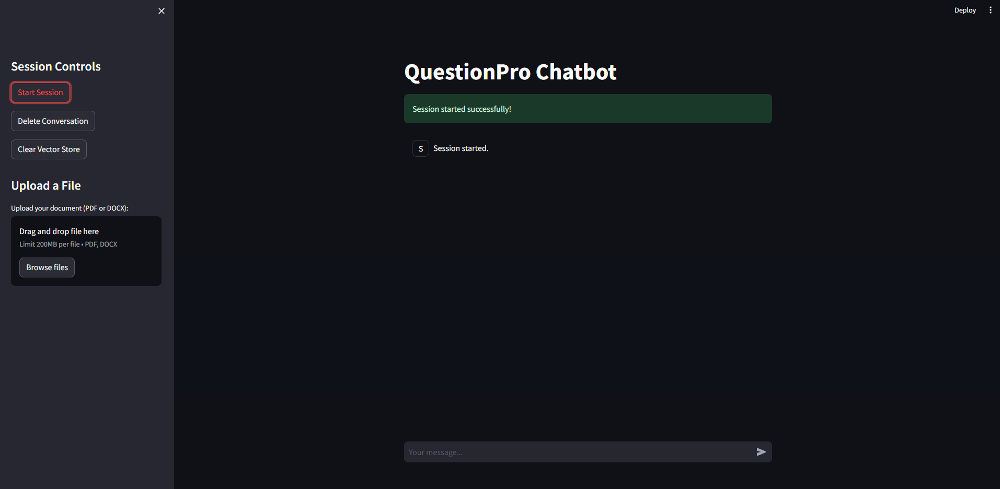
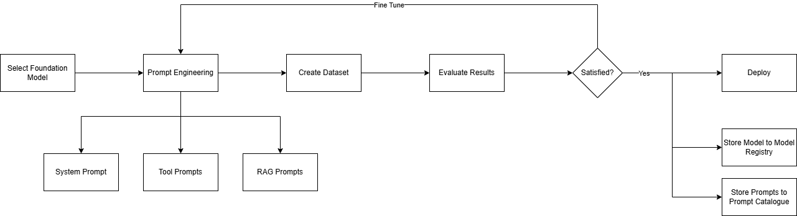
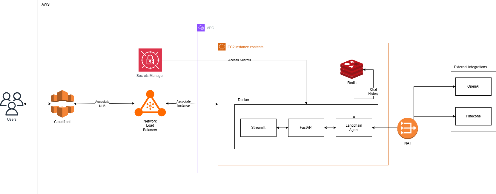

<<<<<<< HEAD
# qp-ai-assessment

A **context-aware chatbot** designed for efficient information retrieval from uploaded documents. Built with FastAPI, Streamlit, and Langchain, this project offers robust features, including error handling, content filtering, and authentication.

---

## **Table of Contents**

1. [Features](#features)
2. [Prerequisites](#prerequisites)
3. [Installation](#installation)
4. [Usage](#usage)
5. [Dependencies](#dependencies)
6. [Notes and Future Work](#notes-and-future-work)
7. [Diagrams](#diagrams)

---

## **Features**

- **Langchain Agent**: Retrieves document-based information and handles out-of-context queries.
- **Content Filtering**: Mitigates inappropriate content like profanity or violent language.
- **Retrieval**: Retrieve top 4 relevant chunks using semantic similarity search. Options like multi-query retriever for optimized relevance.
- **Context-Aware Chat**: Retains context across conversations for a seamless user experience.
- **Document Management**: Upload, delete, and manage documents in the vector store.
- **Evaluation Tools**: Provides tools for agent evaluation using Langsmith and customized evaluation chains.
- **Security**:
  - CORS restrictions.
  - Rate limits and API authentication.
- **Extensibility**:
  - On-prem LLM/vector store support.
  - Modular CRUD for vector store management.

---

## **Prerequisites**

- **Redis** must be installed on the machine.

---

## **Installation**

### **Manual Setup**
1. Clone the repository:
   ```bash
   git clone <repository-url>
   cd <repository-directory>
   ```
2. Create a virtual environment:
   ```bash
   python -m venv venv
   source venv/bin/activate   # On Windows, use venv\Scripts\activate.ps1
   ```
3. Install dependencies:
   ```bash
   pip install -r requirements.txt
   ```
4. Start the application:
   - Backend: 
     ```bash
     python all_api.py
     ```
   - UI:
     ```bash
     streamlit run streamlit_ui/UI.py
     ```

### **Using Docker**
1. Clone the repository and navigate to it.
2. Build the Docker image:
   ```bash
   docker build -t question-pro-bot .
   ```
3. Run the Docker container:
   ```bash
   docker run -p 8012:8012 -p 8501:8501 -e REDIS_URL=redis://host.docker.internal:6379 question-pro-bot
   ```

---

## **Usage**

Users can interact with the chatbot via the web-based UI or APIs provided by the FastAPI backend. Features include:
- Uploading or managing documents.
- Querying context-aware or document-specific information.
- Evaluating agent performance with built-in tools.

---

## **Dependencies**

All dependencies are listed in the `requirements.txt` file. Key dependencies include:
- **Langchain**: For building the chatbot agent.
- **FastAPI**: For the backend.
- **Streamlit**: For the UI.
- **Redis**: For caching and storage.
- **OpenAI** and **Pinecone**: For LLM and vector store capabilities (demo purposes).

---

## **Notes and Future Work**

1. **Current Configuration**:
   - Uses OpenAI and Pinecone for stable results.
   - Langsmith traces all requests for ML/LLMOps.

2. **Planned Improvements**:
   - Shift to on-prem LLMs and vector stores for enhanced control.
   - Refined retrieval techniques, e.g., re-enabling the multi-query retriever.
   - Build modular CRUD operations for vector store document management.
   - Implement dynamic index creation for session-based document separation.
   - Add advanced logging mechanisms for better debugging and analytics.

3. **Evaluation**:
   - Utilizes `langchain-ai/rag-answer-vs-reference` metric for performance analysis.
   - Plans to enhance evaluation pipelines with more metrics and flexible configurations.

---

## **Diagrams**
- UI Overview


- Sample_LLMOps_pipeline


- Proposed AWS Architecture

---
=======
# qp-ai-assessment
>>>>>>> 93387d4fde18933e710e4bf62a51adc65b0c1d50
